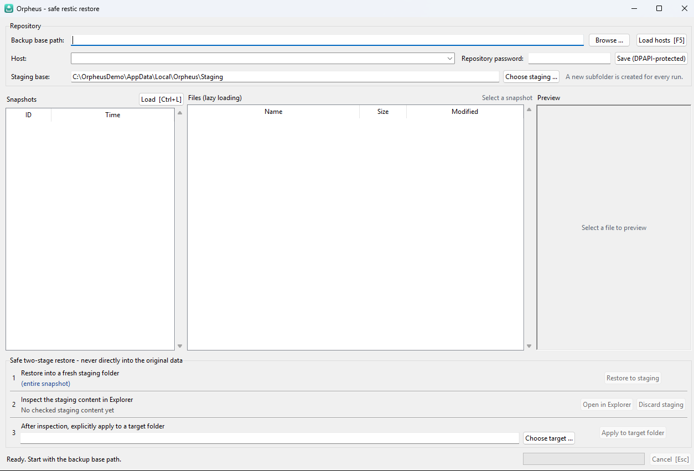

# Orpheus

A Windows GUI for **safe, selective restores from restic backups**. Built with
Python and Tkinter/ttk.

Orpheus never lets restic write into your original data. Every restore goes into a
fresh staging folder first; you inspect it, and only then apply it to a target –
with a list of everything that would be overwritten.



## Quick start

1. Download `Orpheus.exe` from the [latest release](../../releases/latest)
   (restic is bundled), or build it yourself – see [Building](#building).
2. Start it. Pick your **backup base path**, press **Load hosts** (F5).
3. Choose a host, enter the repository password, press **Load** (Ctrl+L).
4. Browse the snapshot, select a file or folder (or nothing for the whole snapshot)
   and press **Restore to staging**.
5. **Open in Explorer**, check the files, then **Apply to target folder**.

## Expected repository layout

Orpheus expects one restic repository per host below a common base path:

```text
<backup base path>\<HOSTNAME>          e.g.  Z:\Backup\Restic\webserver
                                              \\nas\Backup\Restic\laptop
```

The base path can be a mapped drive or a UNC path. Authentication to the NAS is left
to Windows; Orpheus never stores NAS credentials. Repositories on other backends
(S3, SFTP, REST server) are not supported by the host discovery – mount or map them
as a folder, or use the restic CLI directly.

## Safety principle

1. Pick host and snapshot, optionally one file or folder in the lazy-loading browser.
2. **Restore to staging** creates a new, marked subfolder per run. Restoring a whole
   snapshot requires an explicit confirmation.
3. **Open in Explorer** for a visual check. Cancelled or failed runs can be inspected
   or discarded, but never applied.
4. **Apply to target folder** inventories the staging content, lists every existing
   file that would be replaced and only replaces them atomically after a second
   confirmation.

Staging is never cleaned up automatically, and database dumps are never imported.

## Configuration

Everything is set in the GUI and stored per Windows user:

| What | Where |
|---|---|
| Backup base path, staging folder | `%APPDATA%\Orpheus\config.json` |
| Repository passwords (per host) | `%APPDATA%\Orpheus\secrets.bin`, encrypted with Windows **DPAPI** |
| Directory listing cache | `%APPDATA%\Orpheus\ls_cache\` |
| Default staging folder | `%LOCALAPPDATA%\Orpheus\Staging` |

Passwords never appear on a command line or in a log; restic receives them only
through a private copy of the child process environment. The DPAPI blob can only be
decrypted by the same Windows user on the same machine.

If you choose a staging folder on a network share, Orpheus warns you: the share's
permissions may be broader than the per-user default.

Keyboard: `F5` load hosts, `Ctrl+L` load snapshots, `Enter` in the password field
loads snapshots, `Esc` cancels the running action.

## Building

Requirements: Windows 10/11, Python 3.10+, and `restic.exe` in `bin\restic.exe`
([restic releases](https://github.com/restic/restic/releases), `windows_amd64` zip).

```powershell
python -m pip install -r requirements-dev.txt   # pytest + Pillow
python -m pytest                                  # never calls a real restic or NAS
python main.py                                    # run from source
```

Single-file executable and installer:

```powershell
python -m pip install pyinstaller
pyinstaller Orpheus.spec                          # -> dist\Orpheus.exe (restic bundled)
iscc installer\setup.iss                          # optional, needs Inno Setup
```

The [build workflow](.github/workflows/build.yml) does the same on GitHub: tests on
every push, `Orpheus.exe` as a build artifact, and a release when a `v*` tag is
pushed.

## Uninstall

Remove `Orpheus.exe` (or uninstall via *Apps* if you used the installer), then delete
`%APPDATA%\Orpheus` and `%LOCALAPPDATA%\Orpheus` if you do not need the saved settings
or staging runs anymore.

## Project layout

| Path | What |
|---|---|
| `orpheus/restic_client.py` | cancellable restic process layer, error classification |
| `orpheus/restore_service.py` | staging sessions, transfer plan, atomic apply |
| `orpheus/config.py`, `dpapi.py` | settings and DPAPI-protected password store |
| `orpheus/gui*.py`, `ui.py` | Tkinter controller and view |
| `assets/` | icon source and generator ([details](assets/README.md)) |
| `tests/` | unit tests, no real restic or network access |

## License

[MIT](LICENSE). restic itself is licensed under BSD-2-Clause.
